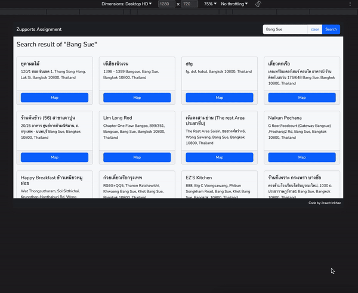

# Zupports Assignment

__Assignment:__

Create a simple __Responsive__ web application to show the list of __Restaurant__ by using Google Map API which users can enter a keyword to search, default the keyword to __Bang Sue__.


## ENVIRONMENT SET UP ##

1. Set up '.env' file.
```bash
cp .env.example .env
```
*NOTE: Below is mandatory settings for this project.*
```bash
# CACHED EXPIRED (seconds)
CACHE_EXPIRED=600

# GOOGLE API KEYS
GOOGLE_MAP_API_KEY=

# FOR VueJS by VITE
VITE_API_URL=http://localhost:8000
VITE_GOOGLE_MAP_API_KEY=*
```

2. Install depencies.
```bash
composer install
composer dump-autoload
php artisan key:generate
npm install
```

3. Start Web Server
```bash
# Webserver
php artisan serve
```
```bash
# Frontend Script (auto refresh when script update)
npm run dev
```

4. Open app in browser by using http://localhost:8000

## SAMPLE


---
***Project by:*** *[Jirawit Inkhao](https://github.com/hey008)*